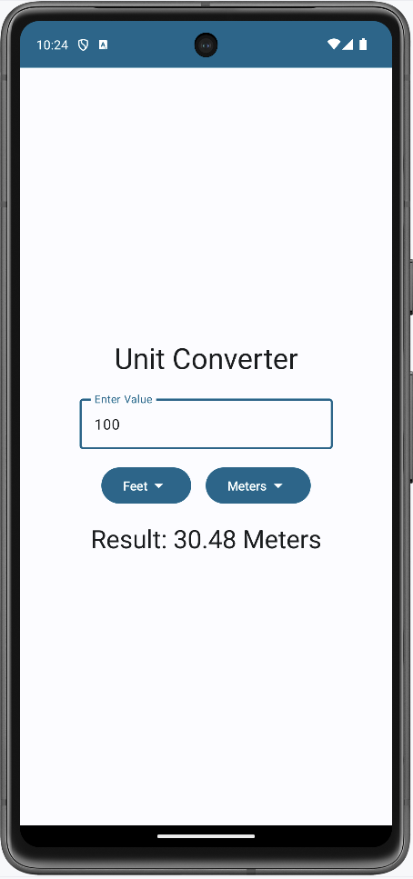

# ConverterApp (Unit Converter)

A simple Android application built with **Kotlin** that allows users to convert between different units such as **Feet ↔ Meters**.  
This project was created as a learning exercise for Android development.

---

## 🚀 Features
- Convert values between different units (e.g., Feet to Meters).
- Simple and clean UI using **Jetpack Compose**.
- Real-time conversion as you type.
- Dropdown menus to select input and output units.

---

## 📸 Screenshot

  

---

## 🛠️ Tech Stack
- **Language**: Kotlin
- **Framework**: Android Jetpack Compose
- **Tools**: Android Studio, Gradle

---

## 📂 Project Structure
